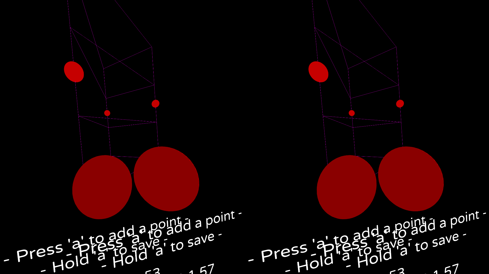

# LÖVR Playspace

**LÖVR Playspace** is a room boundary overlay for OpenXR, made with **LÖVR**.

Avoid bumping into walls! LÖVR Playspace works on any OpenXR runtime that implements EXTX_overlay - currently this is limited to Monado-based runtimes.

For more information about Monado and the Linux FOSS VR stack, check out the [Linux VR Adventures Wiki][lvra-wiki].

[](assets/preview.png)

## Installation

Your OpenXR runtime must be up and running before starting LÖVR Playspace.

- **Arch Linux**: Use your AUR helper (paru or yay) to install [`lovr-playspace-bin`][aur-bin] or [`lovr-playspace-git`][aur-git] from the AUR. Note that using paru's Chroot option may not be working yet.
- **All other distros**: Download the all-in-one AppImage from the [latest release][release]. Either double-click the AppImage from your file browser, or run it in a terminal after `chmod +x`ing it.

## Autostarting with Envision

> [!TIP]
> If you're using Envision, you can launch LÖVR Playspace automatically when starting VR by using the [plugin system in Envision][envision-plugin].

- **Arch Linux**: Both AUR packages include the required .desktop file. Once installed, **LÖVR Playspace** will show up in Envision's plugins menu.
- **All other distros**:
  - Sorry, stuff like Gear Lever won't work yet.
  - Make sure the AppImage file has execute privileges.
  - Download [lovr-playspace.desktop][desktop], save it to `~/.local/share/applications/`.
  - Download [lovr-playspace.png][icon], save it to `~/.local/share/icons/hicolor/256x256/apps/`.
  - For both `Exec` and `X-XR-Plugin-Exec` keys in the .desktop file, replace `lovr-playspace` with the full path to the AppImage file you downloaded.
  - **LÖVR Playspace** will show up in Envision's plugins menu.

[release]: https://github.com/SpookySkeletons/lovr-playspace/releases/latest
[envision-plugin]: https://wiki.vronlinux.org/docs/fossvr/envision/#plugin-system
[lvra-wiki]: https://wiki.vronlinux.org/
[aur-bin]: https://aur.archlinux.org/packages/lovr-playspace-bin
[aur-git]: https://aur.archlinux.org/packages/lovr-playspace-git
[desktop]: https://raw.githubusercontent.com/SpookySkeletons/lovr-playspace/refs/heads/main/dist/usr/share/applications/lovr-playspace.desktop
[icon]: https://raw.githubusercontent.com/SpookySkeletons/lovr-playspace/refs/heads/main/dist/usr/share/icons/hicolor/256x256/apps/lovr-playspace.png

## Running from source

Prerequisites:

- **LÖVR**: If your distro has no package for it, I recommend downloading the [latest LÖVR AppImage](https://github.com/bjornbytes/lovr/releases/latest).
- **git**: Required to git clone LÖVR Playspace, *with submodules!*
- OpenXR runtime must be up and running

```bash
git clone "https://github.com/SpookySkeletons/lovr-playspace" --recurse-submodules
chmod +x ./lovr-v*.AppImage
./lovr-v*.AppImage lovr-playspace
```

If you get "module 'json/json' not found", ensure you properly cloned this repo with git submodules.

## How to use

Press `action_button` (Trigger by default) to set points. Hold `action_button` to save the points - this will end edit mode. If you want to get back into edit mode, hold `action_button` while the program starts, or delete the `points.json` file. Other settings have to be configured with a text editor, see below.

## Configuration

Settings files are stored in one of these directories, depending on how you're running LÖVR Playspace:

- `~/.local/share/lovr-playspace` (from our all-in-one AppImage)
- `~/.local/share/LOVR/lovr-playspace` (from source)
<!--
not always ~/.local/share/LOVR/lovr-playspace like the LOVR docs suggest. AppImage implies filesystem.isFused?
https://github.com/bjornbytes/lovr/blob/f7e7fd7ce7b193264b457db8b26588bb1a944f7b/src/modules/filesystem/filesystem.c#L486
-->

### Settings files

- `action_button.txt`: The button to use to do actions like placing points. [See the LÖVR documentation](https://lovr.org/docs/v0.18.0/DeviceButton).
- `color_close_corners.json`: How to color the points you've set when they're close. Borders of edges of your defined shape, as well as your grid\_top/grid\_bottom.
- `color_close_grid.json`: How to color the lines between the corners when close.
- `color_close_corners.json`: How to color the points you've set when they're far.
- `color_close_grid.json`: How to color the lines between the corners when far.
- `fade_stop.txt`: What is considered far away from a wall, in meters. Affects how colors fade.
- `fade_start.txt`: What is considered close to a wall, in meters. Affects how colors fade.
- `grid_bottom.txt`: Where to start drawing lines from, relative to your ground.
- `grid_density.txt`: How much to divide your lines for drawing a grid into it, in meters.
- `grid_top.txt`: Where to stop drawing lines, relative to your ground.
- `points.json`: The points you've set. Does not exist by default.
